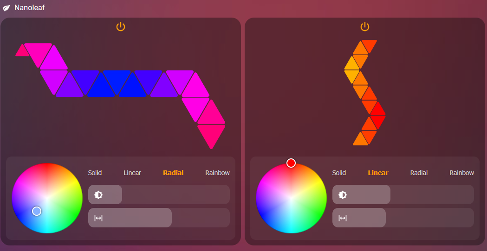

# Nanoleaf Reloaded Card

<p align="center">
  <a href="https://github.com/denczo/nanoleaf-reloaded-card/releases/latest"></a>
  
  
  <a href="LICENSE"></a>
</p>

<p align="center"><b>Jump to:</b> <a href="#-install">📦 Install</a> · <a href="#%EF%B8%8F-setup">⚙️ Setup</a> · <a href="#-configuration">🔧 Configuration</a></p>

Custom Lovelace card for Home Assistant that draws your **actual
Nanoleaf panel layout** and controls power, colour, pattern,
brightness, and spread — all from one card. No HACS card
dependencies, no manual YAML.

The preview renders every panel shape at its real size and position,
so triangles, mini-triangles, squares, and hexagons are all drawn
from your real layout. Built for the companion
[Nanoleaf Reloaded integration](https://github.com/denczo/nanoleaf-reloaded),
which creates all the entities the card needs. **One card controls
one controller** — add another card for another controller.

<p align="center"><br><em>Two controllers, each on its own card</em></p>

> ⚠️ The preview has so far only been tested with **triangle**
> layouts (Shapes triangles + mini-triangles). Other panel types —
> **squares, hexagons** — use the same general rendering algorithm
> but haven't been verified on real hardware, so the preview may be
> off for them. If your preview looks wrong (or anything else
> misbehaves), please
> [open an issue](https://github.com/denczo/nanoleaf-reloaded-card/issues)
> with your panel type and a screenshot — it's the quickest way to get
> other shapes rendering correctly.

If this card brightens your dashboard, you can support its development:

<p align="center"><a href="https://buymeacoffee.com/printersmind"></a></p>

## 📦 Install

### Via HACS (recommended)

1. HACS → ⋮ → **Custom repositories** → add this repo, category
   **Dashboard**.
2. Install, then hard-refresh the browser (clear the service worker
   if the old version sticks).

### Manual

1. Copy `dist/nanoleaf-reloaded-card.js` to `config/www/`.
2. Settings → Dashboards → **Resources** → add
   `/local/nanoleaf-reloaded-card.js` as a **JavaScript module**.

## ⚙️ Setup

1. Install the
   [Nanoleaf Reloaded integration](https://github.com/denczo/nanoleaf-reloaded)
   and pair your controller.
2. Add the card to a dashboard — the visual editor opens.
3. Pick your controller from the **Controller** dropdown; it
   auto-fills every entity. Save.
4. For a second controller, add **another card** and pick that
   controller.

## 🔧 Configuration

The visual editor is the easy path — the Controller dropdown fills
everything in. The YAML it produces:

```yaml
type: custom:nanoleaf-reloaded-card
light_entity: light.nanoleaf_panels
color_entity: light.nanoleaf_base_color
layout_sensor: sensor.nanoleaf_layout
panel_colors_entity: sensor.nanoleaf_panel_colors
pattern_entity: select.nanoleaf_pattern
brightness_entity: number.nanoleaf_brightness
spread_entity: number.nanoleaf_spread
name: Living Room # optional
```

Add one card per controller.

### Entities

All provided by the Nanoleaf Reloaded integration and auto-detected
by the editor:

| Key | Entity | Purpose |
|---|---|---|
| `light_entity` | `light.*_panels` | power + brightness |
| `color_entity` | `light.*_base_color` | pattern source colour |
| `layout_sensor` | `sensor.*_layout` | panel positions (the preview) |
| `panel_colors_entity` | `sensor.*_panel_colors` | per-panel colours |
| `pattern_entity` | `select.*_pattern` | solid / linear / radial / rainbow |
| `brightness_entity` | `number.*_brightness` | brightness 0–100 |
| `spread_entity` | `number.*_spread` | hue spread 0–360° |

## Offline handling

When the `light_entity` becomes `unavailable`, the card shows an
"unreachable" state instead of broken controls and recovers
automatically when the device returns. An optional `reconnect_action`
adds a **Reconnect** button that calls any HA service:

```yaml
reconnect_action:
  service: homeassistant.reload_config_entry
  data: { entry_id: abc123 }
```
